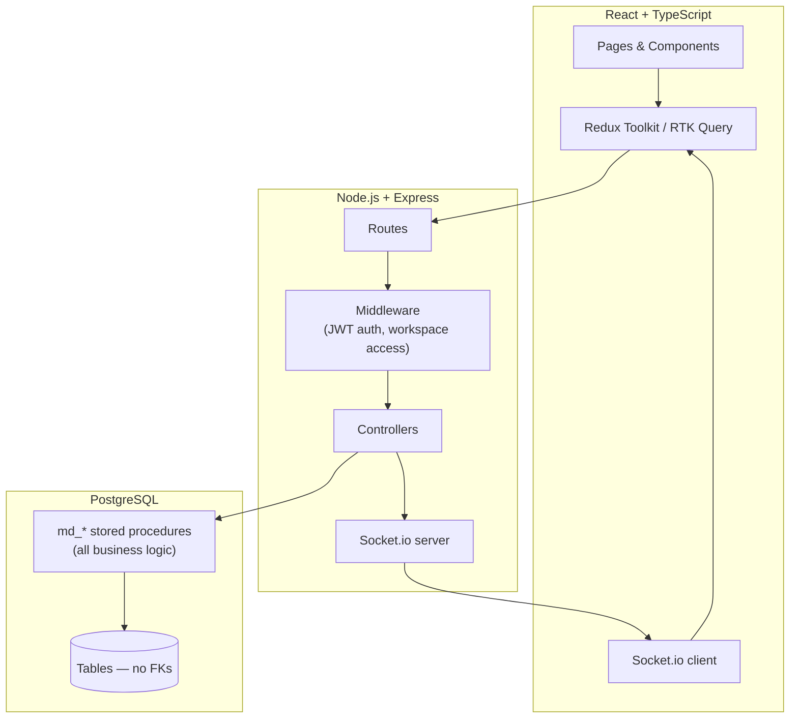

# Boardline — Real-Time Collaborative Task Board

A full-stack project management tool inspired by Trello/Asana — built to demonstrate production-style
patterns: database-side business logic via stored procedures, real-time collaboration, optimistic UI,
and workspace-level access control enforced server-side.

**Stack:** React 18 · TypeScript · Redux Toolkit (RTK Query) · Node.js · Express · PostgreSQL (stored
procedures, no ORM) · Socket.io · JWT · bcrypt

---

## Why this project

Most portfolio CRUD apps put all their logic in the API layer and treat the database as a dumb table
store. This one doesn't:

- **All business logic lives in PostgreSQL stored procedures** (`md_*` functions) — validation,
  cascading deletes, activity logging, and permission checks all happen at the database layer, not
  scattered across controllers.
- **No foreign keys, by design** — referential integrity (existence checks, cascade behavior) is
  handled explicitly inside the stored procedures instead, which is a deliberate trade-off worth
  discussing in an interview.
- **Real-time sync via Socket.io** — every mutation (task moved, comment added, list created) is
  broadcast to everyone viewing that board and merged into the UI without a refetch.
- **Optimistic UI with automatic rollback** — dragging a task, marking it complete, or deleting it
  updates the screen instantly via RTK Query's cache patching, and silently reverts if the request
  fails.
- **Server-side authorization on every route** — workspace membership is checked in Postgres on every
  request, not just hidden in the frontend, so a user can't access another team's data by guessing an ID.

---

## How it works — end to end

```mermaid
flowchart LR
    A[Register / Login] --> B[Dashboard: your workspaces]
    B --> C[Workspace: its boards + members]
    C --> D[Board: lists + tasks]
    D --> E[Task modal: details, comments, activity]
    D -. Socket.io .-> D
```

**1. Auth** — Register with name/email/password (bcrypt-hashed). Login returns a short-lived
**access token** (15 min) and a long-lived **refresh token** (7 days). The frontend silently
refreshes the access token in the background when it expires, so sessions don't drop mid-task.

**2. Workspaces** — A workspace is a team (e.g. "Support team", "Engineering"). Creating one makes
you its `owner`. Owners/admins invite existing Boardline users by email and assign a role
(`owner` / `admin` / `member`); role determines what actions they can perform.

**3. Boards & Lists** — Each workspace holds multiple boards (e.g. one board per sprint or project).
Each board holds lists (columns) like "To Do", "In Progress", "Done".

**4. Tasks** — The core loop: create tasks in a list, drag them between lists, set priority/assignee/
due date, mark complete, comment, and see a full activity log — all generated server-side.

**5. Real-time collaboration** — Everyone on the same board is joined to a Socket.io room. Any
change one person makes (move a task, add a comment, create a list) appears live for everyone else.

**6. Security** — Every request checks the caller's workspace membership against the database before
touching any data — enforced in `md_check_board_access()` / `md_check_member_role()`, not just in
the UI.

---

## Architecture



Controllers never write raw SQL logic — every call is `pool.query('SELECT * FROM md_x($1,$2)', [...])`.
Validation, permission checks, and cascading behavior all live inside the PL/pgSQL functions
themselves, so the same rules apply no matter what calls them.

---

## Project structure

```
├── backend/
│   ├── src/
│   │   ├── db/schema.sql        All tables + md_* stored procedures (idempotent — safe to re-run)
│   │   ├── controllers/         Call stored procedures only, no inline SQL logic
│   │   ├── routes/              Express routers
│   │   ├── middlewares/         JWT auth, workspace/board access checks, global error mapping
│   │   ├── sockets/             Socket.io setup + real-time event emitters
│   │   └── utils/               JWT signing, ApiError, catchAsync
│   └── README.md                Backend setup instructions
│
└── frontend/
    ├── src/
    │   ├── api/                 RTK Query slices (auth, workspace, board, list, task, comment...)
    │   ├── app/                 Redux store
    │   ├── components/          UI kit, layout, board & workspace components
    │   ├── features/auth/       Auth state (persisted to localStorage)
    │   ├── pages/                Login, Register, Dashboard, Workspace, Board
    │   └── sockets/             Socket.io client + live cache patching
    └── README.md                Frontend setup instructions
```

---

## Getting started

**Backend**
```bash
cd backend
npm install
cp .env.example .env        # fill in your DB credentials + JWT secrets
createdb md_taskboard
npm run db:migrate          # applies schema.sql — safe to re-run anytime it changes
npm run dev                 # http://localhost:5000
```

**Frontend**
```bash
cd frontend
npm install
cp .env.example .env        # defaults work out of the box with the dev proxy
npm run dev                 # http://localhost:5173
```

The frontend's Vite dev server proxies `/api` and `/socket.io` to `localhost:5000` automatically —
no CORS configuration needed in development.

---

## API overview

```
POST   /api/auth/register
POST   /api/auth/login
POST   /api/auth/refresh-token
POST   /api/auth/logout

GET    /api/workspaces
POST   /api/workspaces
GET    /api/workspaces/:workspaceId/members
POST   /api/workspaces/:workspaceId/members        (admin/owner only)

GET    /api/boards/workspace/:workspaceId
POST   /api/boards
GET    /api/boards/:id/full                         (nested board → lists → tasks)

POST   /api/lists
PATCH  /api/lists/:id/reorder

POST   /api/tasks
PATCH  /api/tasks/:id
PATCH  /api/tasks/:id/move
PATCH  /api/tasks/:id/complete
DELETE /api/tasks/:id

POST   /api/comments
GET    /api/comments/task/:taskId

GET    /api/activity/task/:taskId
GET    /api/activity/board/:boardId

GET    /api/users/lookup?email=...                  (used by the invite-by-email flow)
```

All routes except `/api/auth/*` require `Authorization: Bearer <accessToken>` and are
authorized against workspace membership server-side.

---

## Screenshots

_Add screenshots here before publishing — e.g. Dashboard, Board view with drag-and-drop, Task detail modal._

```


```

---

## Notable engineering decisions (good interview talking points)

- **Why stored procedures instead of an ORM?** Keeps business logic (validation, cascades, activity
  logging) co-located with the data it governs, and makes it enforceable regardless of which service
  calls it in the future.
- **Why no foreign keys?** A deliberate trade-off — integrity is enforced explicitly in the
  procedures (existence checks, `LIST_BOARD_MISMATCH` validation, manual cascading deletes) rather
  than relying on the database to reject bad writes. Trades some safety net for full control over
  error messages returned to the client.
- **Why optimistic UI?** A kanban board's core interaction is drag-and-drop; waiting on a network
  round-trip before showing the card move would make the whole app feel sluggish.
- **Why a mutex around token refresh?** Multiple simultaneous requests can 401 at the same time when
  a token expires — without deduplication, that would fire several parallel refresh calls and race
  each other.

---

## License

MIT — built as a portfolio project.
